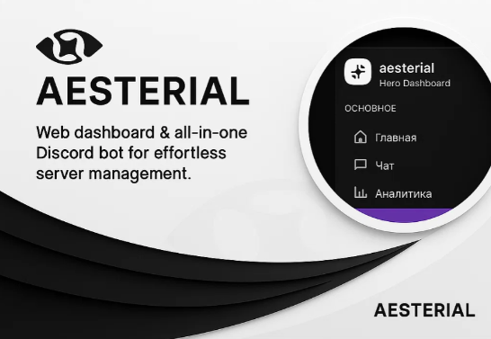

<!-- Hero -->

  

---

    
    <b>Aesterial</b>

---

  ⚡ Разрабатываем инструменты, которые делают Discord-сообщества живыми

---

<!-- Badges -->

  
  
  

---

## 🖿 Проекты
| Repo | Description | Status |
|------|-------------|:------:|
| `Aesterial Panel` | Панель управления ботами | <b>Не Завершён</b>
| `Aesterial Bot` | Бот для дискорд серверов | <b>Не Завершён</b>

---

## 🛠 Стек

 🖵 <b>Frontend</b>

1. <b>Языки</b>: `JavaScript`, `TypeScript`
2. <b>Фреймворки</b>: `Node.js, Vite.js, React.js`
3. <b>Основной разработчик</b>: <i>[Xvalegendary](https://github.com/xvalegendary)</i>

 🖴 <b>Backend</b>

1. <b>Языки</b>: `Go`, `Python`, `SQL`
2. <b>Фреймворки</b>: `Gin, Flask, Discordgo, nextcord`
3. <b>Основной разработчик</b>: <i>[Ivan_kem](https://github.com/Ivanskem)</i>

